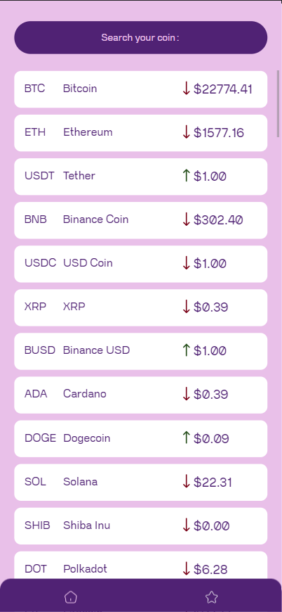

# CryptoCurrencies App

In this app you can see the last moves of the cryptos in the past hours and add to your favorites, your favorites cryptos.

This app is maded with React Native using Expo, and anothers libraries like @react-native-async-storage for save in localStorage the favorites coins.

The API used in this project is: [CoinLore](https://www.coinlore.com/es/cryptocurrency-data-api)

Designed by me: [Figma](https://www.figma.com/file/wXLbia9FfQAZCrc44hhLHp/Crypto-Currencies?node-id=0%3A1&t=10uurfiDp4YwINeC-1)

# Screenshots




# Installation

```bash
$ npm i
```

## Running the App

```bash
$ npm run start

# Then you can select the platform: web, ios or android.
```
